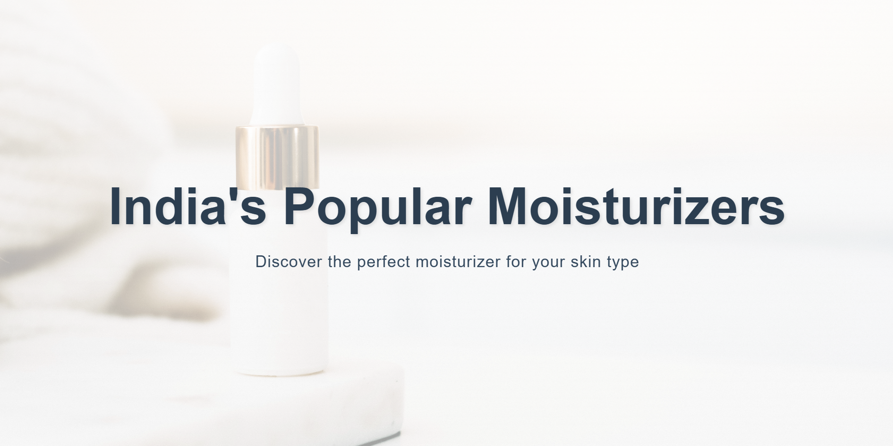

# MoistGlow - India's Popular Moisturizers Guide

A modern, responsive website showcasing popular moisturizers available in India, helping users find the perfect product for their skin type.

## Features

- 🎨 Clean, modern UI with smooth animations and transitions
- 📱 Fully responsive design that works on all devices
- 🖼️ Optimized image loading with lazy loading
- 🎯 Detailed product comparisons and recommendations
- 💡 Educational content about skincare ingredients
- 👥 Real user testimonials and reviews

## Technologies Used

- HTML5
- CSS3 (with modern features like CSS Grid, Flexbox)
- JavaScript (for animations and interactivity)
- Optimized assets and performance best practices

## Key Sections

- Hero section with engaging visuals
- Trending posts about skincare
- Product comparison tables
- Ingredient guide with detailed information
- User testimonials
- Responsive navigation

## Performance Optimizations

- Lazy loading of images
- Preloading of critical assets
- Optimized animations using will-change
- Efficient CSS animations and transitions
- Responsive images for different screen sizes

## Local Development

1. Clone the repository
2. Open `index.html` in your browser
3. Edit styles in `styles.css`

## Credits

- Images from Unsplash and Pexels
- Icons from [Font Awesome](https://fontawesome.com/)
- Fonts from Google Fonts

## License

MIT License - feel free to use this project for learning or personal use.
